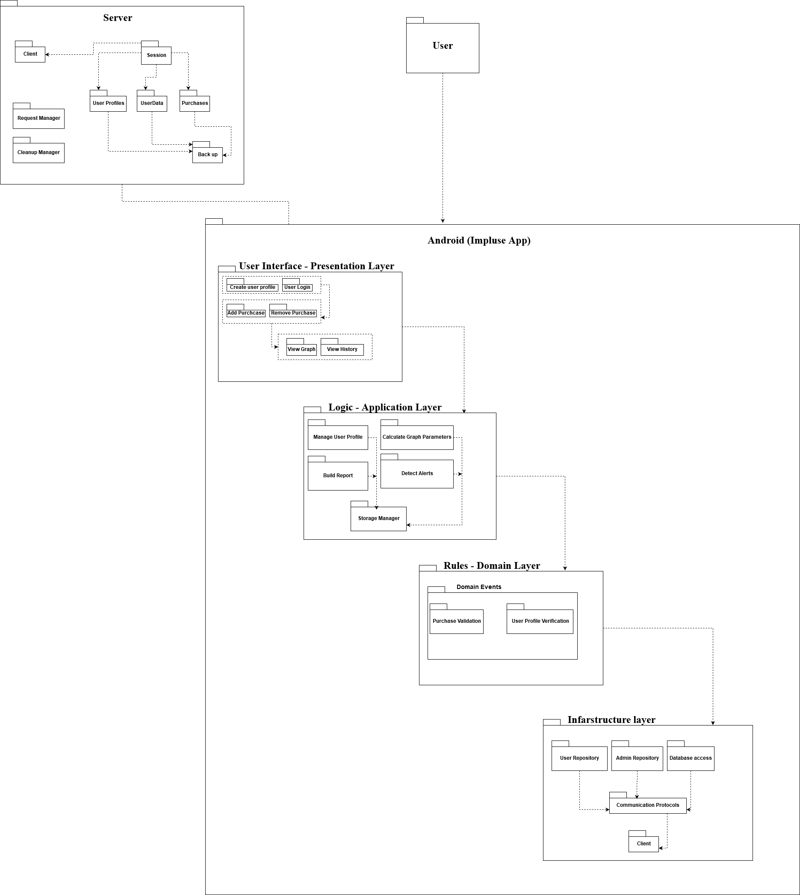
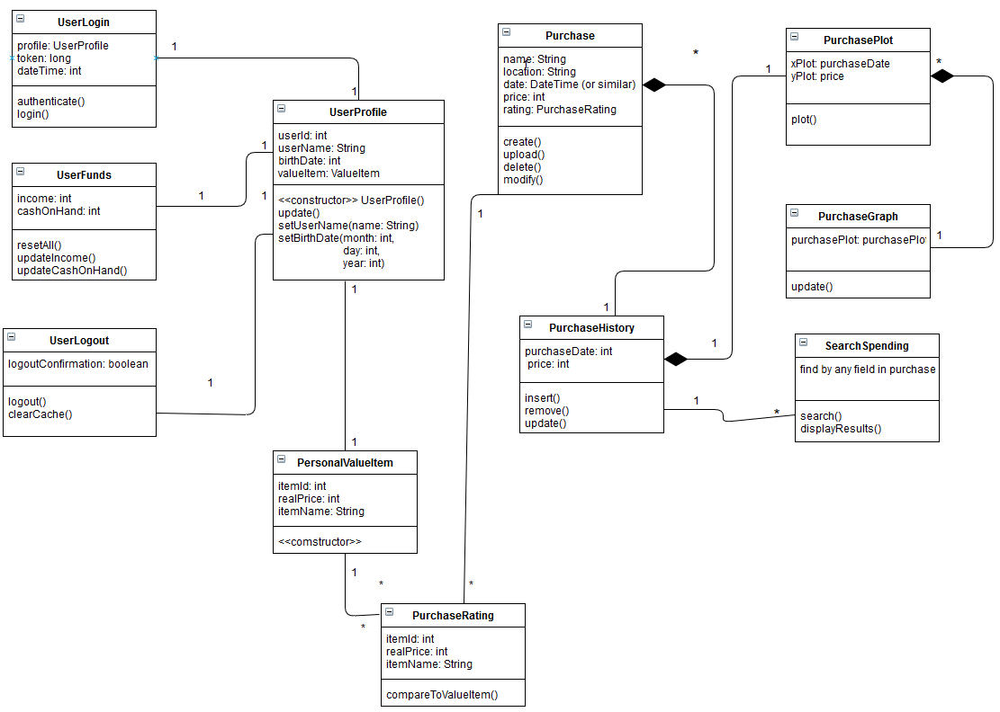
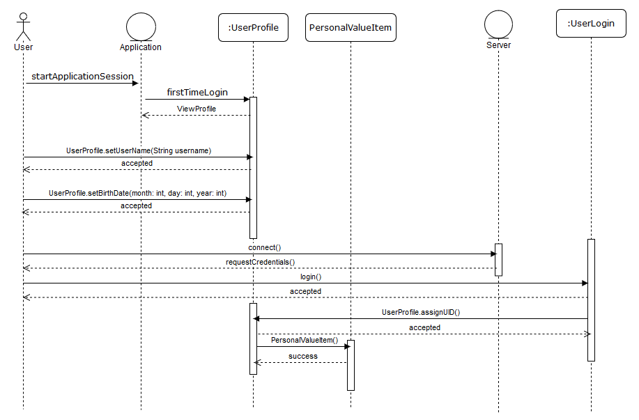

# Design ( *Deliverable-05* )

## 1. Description.
Our application is an impulse tracker application for android phones and tablets. We decided this based on what we found in our interviews which was, young adults frequently have issues with over-spending related to limited experience with their new luxury of disposable income. The Impulse Tracker mobile app provides an easy and intuitive way to track your impulse spending habits and even help you make the right choice in your purchases. This app will help the user build healthier spending habits that prevent regret, impulsive spending, and purchases that are unsustainable. It will also provide a little bit of guidance for young adults that have issues with overspending and poor habits when it comes to using their money wisely.

This application will require the user to have a username, email, and password for the user to login to the application. The application will also allow for the user to input, delete, and modify their personal information, financial information and purchases. This application will also allow the user to search their entered purchase history which contains all the purchases they have entered. When searched for, the app will display the resulting purchase(s) and the user can then delete or modify the purchase if they need to. Based on this purchase history the application will create a graphical depiction of how the user is spending their money.

## 2. Architecture.
  ## Architecture Diagram
  
  For our architecture we decided to use a layered structure. We found this to be the best option due to it's simplicity and readability. The software can be brokenvdown into a 4 layers which we can work on seperately, this also helps with debugging and testing. This architecture allows us to build our software faster and make it more reliable product in a short period of time. Although the architecture provides alot of benefits, it might prove to be hard to scale due to inherit qualities of it's architecture. Overall, we belive this is the best structure for our app.
  
## 3. Class Diagram 
  ## UML
  

## 4. Sequence Diagram
   

## 5. Design Patterns 

## 6. Design Principals
Single Responsibility: the PlanPurchase will only store the items which we plan to buy. [link](https://github.com/CS386-ImpulseTracker/MobileApp/blob/stage_design/ImpulseApp/app/src/main/java/com/example/impulseapp/PlanPurchase.java/)

Dependency Inversion Principle: The code follows this principle because the Server and Data handling do not depend on the clients to do anything. They simply process requests from the user devices and work on enqueuing the request.[link](https://github.com/CS386-ImpulseTracker/MobileApp/blob/stage_design/ImpulseApp/build.gradle/)